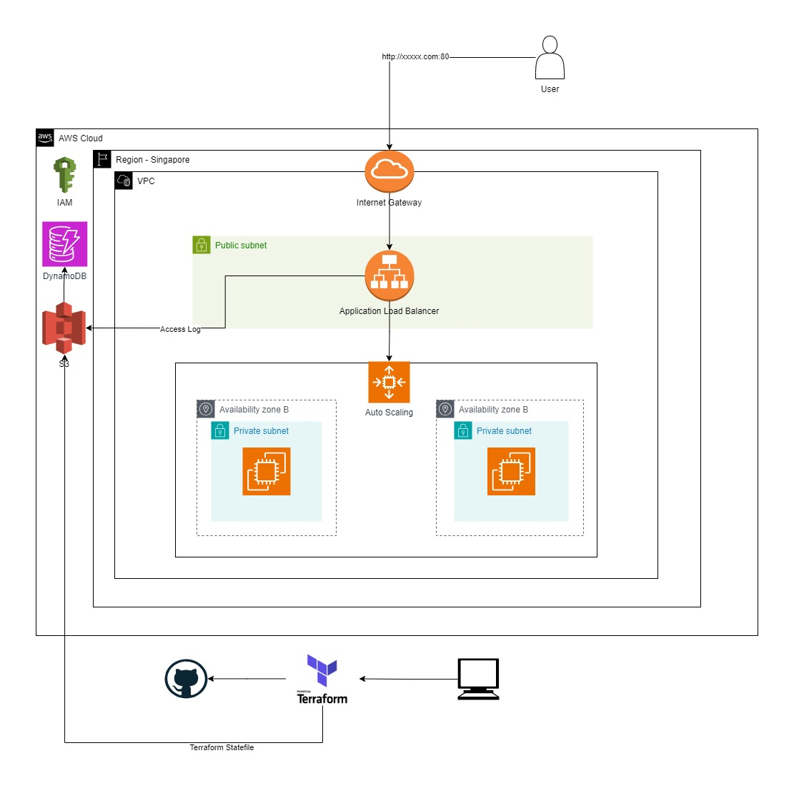

<h1>Apache Webserver Deployment with Terraform on AWS</h1>

<h2>Goal</h2>

The primary objective of this project is to utilize Terraform Infrastructure as Code (IaC) to deploy an Apache Webserver on the AWS cloud. This involves creating necessary AWS resources, configuring a Virtual Private Cloud (VPC), and deploying the webserver within it.

<h2>Pre-Requisites</h2>
<h3>Terraform Resources Setup</h3>
<ol>
  <li><strong>S3 Bucket for Terraform Statefiles:</strong> Create an S3 bucket to store Terraform state files.</li>
  <li><strong>DynamoDB Table for State Locking:</strong> Create a DynamoDB table for Terraform state locking. (Optional)</li> 
  <li><strong>VPC Network Deployment:</strong> Deploy a VPC network using Terraform IaC and store the state file in the S3 backend.</li>
  <li><strong>SNS Topic for Notifications:</strong> Create an SNS topic for notifications.</li>
  <li><strong>IAM Role:</strong> Create an IAM role.</li>
  <li><strong>Golden AMI:</strong> Create a Golden AMI for the webserver.</li>
</ol>
<h2>Deployment</h2>
<h3>Deploying Resources in the VPC</h3>

Add configurations for IAM Role, Launch Configuration, Auto Scaling Group, Target Group, ALB, DNS, CloudWatch Alarms, and Scaling Policies.

<h2>Validation</h2>
<ol>
  <li><strong>AWS Console:</strong> Login to the AWS Console and verify that all resources are deployed.</li>
  <li><strong>Web Application Access:</strong> Access the web application from a public internet browser using the domain name.</li>
</ol>
<h2>Deployment</h2>

Write Terraform IaC to deploy the following resources in the VPC that was created in the Pre-Requisites step. Keep the state file in S3 backend with state locking support.

<ol>
  <li>
    <strong>Create IAM Role:</strong> Grant PUT/GET access to S3 Bucket and Session Manager access.
  </li>

  <li>
    <strong>Create Launch Template:</strong> Create the AMI image that include all the prerequiste for the webserver (Apache, Nginx).
  </li>

  <li>
    <strong>Create Auto Scaling Group:</strong> Set Min: 1, Max: 1, Desired: 1 in the private subnet.
  </li>

  <li>
    <strong>Create Target Group:</strong> Set up health checks and attach it to the Auto Scaling Group.
  </li>

  <li>
    <strong>Create Application Load Balancer:</strong> Deploy in the public subnet and configure Listener Port to route traffic to the Target Group.
  </li>

  <li>
    <strong>Create CloudWatch Alarms:</strong> Set up alarms to send notifications when the Auto Scaling Group state changes.
  </li>

  <li>
    <strong>Create Scaling Policies:</strong> Implement policies to scale out/scale in when average CPU utilization is > 80%.
  </li>
</ol>

Deploy Terraform IaC to create the resources.

<h2>Destroy</h2>

To avoid incurring unnecessary costs, run the following command to destroy the resources once testing is over:

<pre><code>terraform destroy</code></pre>
</body>
</html>
